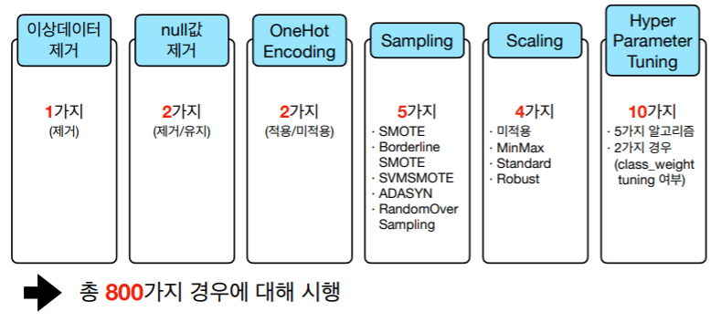

# 쏘카 보험 사기 찾기

</img> 

## 1. Socar Introduction
</img> 

- 매년 증가하는 가입자 수와 매출액만큼 socar 보험사기 역시 끊이질 않고 있음. 데이터를 기반으로 모델링을 구현하고 그 중 신뢰도가 가장 높은 모델을 선정해볼 예정. 
## 2. 개요
### 2-1. 데이터 수집 

- 데이터는 카쉐어링업체 SOCAR로부터 제공받았으며, 16000 rows X 35 columns의 데이터로 구성되어 있음.
- 데이터는 socar로부터 제공받은 데이터로 column들을 전부 비공개로 수정하였음.

### 2-2. 데이터 탐색
- 이상치 데이터 삭제 
    - 우리가 받은 socar 데이터에는 11:00 ~ 13:00 사이에 6시간 미만으로 대여했는데 21시에 사고가 발생하는 등 이러한 데이터들이 41개 있었음. 전부 삭제하고 진행.
- 데이터 불균형

</img> 

==>  극심한 데이터 불균형 문제는 뒤에서 다양한 샘플링 적용.

## 3. 진행 과정

### 3-1. 구조도
</img> 

### 3-2. 데이터 전처리
- _이상치 삭제_  
    - (대여시간/대여기간/사고시간이 서로 맞지 않는 경우)
- _NULL값(결측치) 유지/삭제_ 
    - (결측치가 과하게 많이 들어있는 컬럼같은 경우 유지한 것과 삭제한 것의 경우를 비교해볼 수 있도록 나눠서 모델링 진행.)
- _OneHotEncoding 적용/미적용_ 
    - (원핫인코딩 역시 적용한 경우, 미적용한 결과를 비교해볼 수 있도록 나눠서 모델링 진행.)
- Sampling_ 
    - (SMOTE, BorderlineSMOTE, SVMSMOTE, ADASYN, RandomOverSampling)
    - UnderSampling은 라벨데이터의 갯수가 너무 적어 적용시키기에 적합하지 않다고 판단.
- _Scaling_ 
    - (MinMax/Standard/Robust)

### 3-3. Models
- _LogisticRegression_
- _Decision tree_
- _RandomForest_
- _LGBM_
- _SVM_
### 3-4. HyperParameter
</img> 

### 3-5. 성능 비교 
</img> 

### 3-6. 성능 평가 
- recall을 주요 성능 지표로 두고, recall이 같을 경우 accuracy를 보조지표로 둠.
- 사용자보단 기업 입장에서 모델을 사용할 경우를 목적으로 하여 recall을 주요 성능 지표로 둠. 
- 모델이 모든 예측 값을 사기 집단으로 판단하는 것을 방지하고자 accuracy를 보조지표로 둠. 

### 3-7. 모델 검증
</img> 
- 총 5가지를 모델로 다음과 같은 성과를 거두었으며, 그 중에서도 SVMSMOTE 샘플링을 이용한 LogisticReg 모델이 가장 높은 성능을 보임.

## 4. Reference
- The scoring parameter: defining model evaluation rules
    - https://scikit-learn.org/stable/modules/model_evaluation.html#scoring-parameter
- GridSearchCV 
    - https://studychfhd.tistory.com/227
## 5. 함께한 분석가
- 김도겸
    - GitHub : <github.com/dockyum>
- 임현수
    - GitHub : <github.com/EbraLim>
- 류승환
    - GitHub : <github.com/ryuseunghwan1>